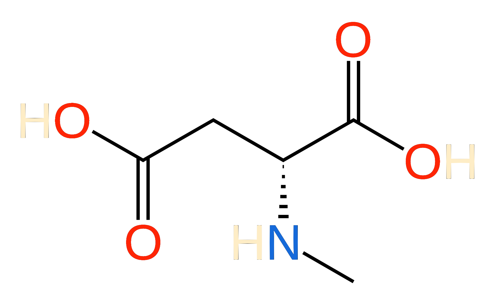
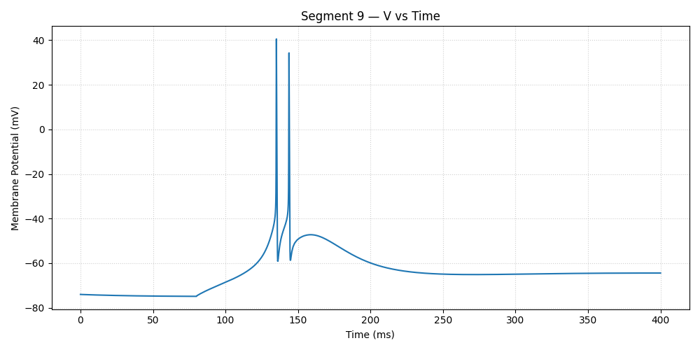
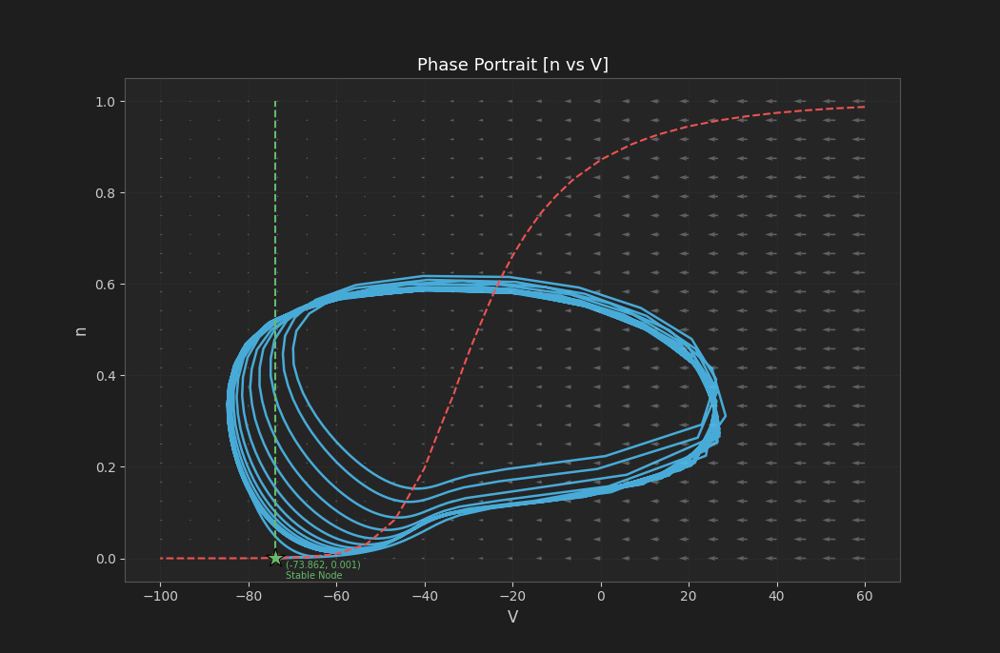
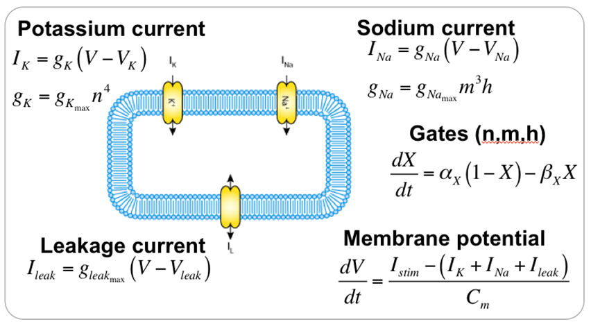
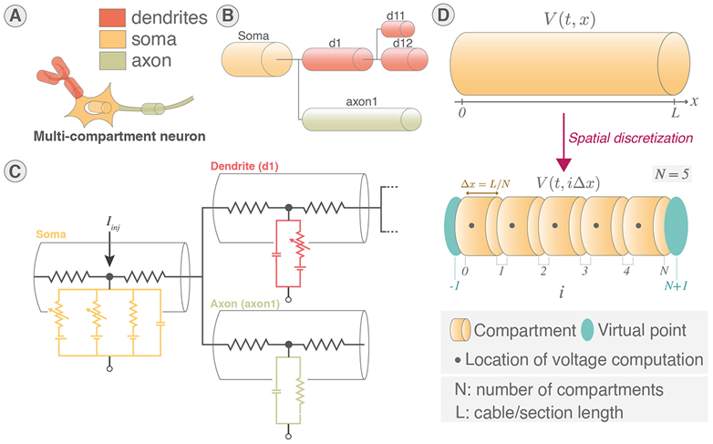

<<<<<<< ours

# PupuNMDA
Neuron Modeling and Dynamics Analysis XD


 Copyright 2026 [Hepbmstl Hepupu]

 Pupu NMDA / NeuronCAD
 A Multi-Compartment Neuron Modeling and Dynamics Analysis Platform

 Licensed under the Apache License, Version 2.0 (the "License");
 you may not use this file except in compliance with the License.
 You may obtain a copy of the License at

 http://www.apache.org/licenses/LICENSE-2.0

 Unless required by applicable law or agreed to in writing, software
 distributed under the License is distributed on an "AS IS" BASIS,
 WITHOUT WARRANTIES OR CONDITIONS OF ANY KIND, either express or implied.
 See the License for the specific language governing permissions and
 limitations under the License.

=======
# PupuNMDA / NeuronCAD

PupuNMDA 是一个面向多区室神经元的桌面建模、仿真与动力学分析平台。它把 WPF/Helix Toolkit 三维形态编辑、conductance-based 离子通道模型、Python Hines 求解器和报告分析工具放在同一个工作流里。



> 当前项目仍处于研究和原型开发阶段。仿真结果适合用于模型构建、数值探索和文献结果复现，正式生物学结论仍应结合原始模型、参数来源和实验背景进行校验。

## 功能概览

- **三维神经元建模**：使用 WPF 与 Helix Toolkit 构建胞体、轴突、树突等形态单元，并支持移动、旋转、连接和属性编辑。
- **多区室仿真**：将可视化结构离散为 compartment，支持按 `NSeg` 或 `LSeg` 进行分段。
- **离子通道参数**：内置 Hodgkin-Huxley 型 Na/K/Leak 通道与 T 型钙电流 CaT/GHK 模型，并支持全局反转电位和通道参数配置。
- **刺激与记录设备**：支持 current clamp、voltage clamp 和 probe，设备位置会绑定到对应区室。
- **Python 数值后端**：通过 `pythonnet` 调用 `Backward/Hines_method.py`，执行 Hines 方法、CaT 线性化、探针数据导出和相图分析。
- **结果报告**：支持查看区室、绘制变量时间曲线、生成局部二维相图、向量场、零流线和平衡点稳定性信息。


## 示例结果

| TC 神经元电压响应 | 局部动力学相图 |
| --- | --- |
|  |  |

| 经典 HH 电流与门控变量 | 多区室电缆离散化 |
| --- | --- |
|  |  |

## 生物物理与数值方法

PupuNMDA 的计算核心可以分为三层：

1. 单个膜片上的 Hodgkin-Huxley 离子通道动力学。
2. 连接多个膜片或区室的电缆方程。
3. 用于稳定推进树状多区室系统的 Crank-Nicolson 与 Hines 方法。

典型区室电压方程可以写为：

$$
C_i \frac{d V_i}{d t}
=
- I_{\mathrm{ion},i}
+ I_{\mathrm{stim},i}
+ \sum_j g_{ij}(V_j - V_i)
$$

其中相邻区室之间的轴向耦合项会在隐式时间推进中形成稀疏线性系统。Hines 方法利用神经元形态的树状拓扑重新组织矩阵，使多区室电缆方程能够高效求解。

T 型钙电流使用 GHK 通量形式，并在每个时间步对电流关于电压进行局部线性化，使 CaT 电流可以并入 Hines 方程组。当前相图工具不是完整高维系统的全局降维，而是在某个仿真时刻固定其余状态变量，对指定两个变量做局部二维切片。

## 仓库结构

```text
PupuNMDA/
|-- App.xaml, App.xaml.cs        WPF 应用入口
|-- NeuronCAD.csproj             .NET 8 WPF 项目文件
|-- Backward/                    Python 后端与 C# 调用桥
|   |-- Hines_method.py          多区室求解器、探针导出、相图分析
|   |-- PythonWorker.cs          Python 运行时与 GIL 工作线程
|   |-- SimulationRunner.cs      C# 到 Python 的仿真调度
|   `-- SaveLoadManager.cs       项目保存、加载和结果数据结构
|-- Visuals/                     WPF 窗口、建模、仿真、报告界面
|-- PupuNMDA.assets/             README 图片与说明素材
|-- runtime-payload/             发布时使用的 Python 运行时载荷，开发环境可能存在
`-- LICENSE                      Apache-2.0 许可证
```

## 构建与运行

### 环境要求

- Windows 10/11
- .NET 8 SDK
- 发布或仿真运行时需要 Python 3.12 运行时包，包含 `numpy`、`scipy`、`matplotlib`、`tkinter` 等依赖

### 从源码构建

```powershell
dotnet restore .\NeuronCAD.csproj
dotnet build .\NeuronCAD.csproj -c Debug
dotnet run --project .\NeuronCAD.csproj
```

如果运行仿真时提示缺少 bundled Python runtime，请确认生成目录中存在：

```text
bin/Debug/net8.0-windows/runtime/python/python312.dll
bin/Debug/net8.0-windows/runtime/python/Lib/site-packages/
```

在本地已有 `runtime-payload` 的情况下，可以把其中的 `runtime` 目录复制到构建输出目录：

```powershell
Copy-Item -Recurse -Force .\runtime-payload\runtime .\bin\Debug\net8.0-windows\
```

### 发布

```powershell
dotnet publish .\NeuronCAD.csproj -c Release -r win-x64 --self-contained true
```

发布目录应至少包含：

```text
NeuronCAD.exe
Backward/Hines_method.py
runtime/python/python312.dll
runtime/python/Lib/site-packages/numpy/
runtime/python/Lib/site-packages/scipy/
runtime/python/Lib/site-packages/matplotlib/
runtime/python/tcl/
```

## 基本工作流

1. 在 **Modeling** 中创建 soma、axon、dendrite，并调整几何尺寸、连接关系和通道参数。
2. 在 **Simulating** 中设置区室分段方式，放置 current clamp、voltage clamp 或 probe。
3. 点击 Begin 运行仿真，Python 后端会组装区室、设备和通道参数并执行 Hines 求解。
4. 在 **Reporting** 中查看区室、绘制变量随时间变化的曲线，或基于 probe 结果生成局部相图。
5. 使用保存和加载功能复用项目结构与仿真结果。

## 参考模型与资料

- Hodgkin-Huxley 型 Na/K/Leak 通道动力学
- 多区室 cable equation 与 Hines 隐式求解方法
- T 型钙电流 CaT/GHK 与胞内钙浓度更新
- Destexhe 等人丘脑皮层神经元放电结果复现
- 快慢动力学相图、零流线和局部稳定性分析

## License

Copyright 2026 Hepbmstl Hepupu

Pupu NMDA / NeuronCAD is licensed under the Apache License, Version 2.0. See [LICENSE](LICENSE) for details.
>>>>>>> theirs
